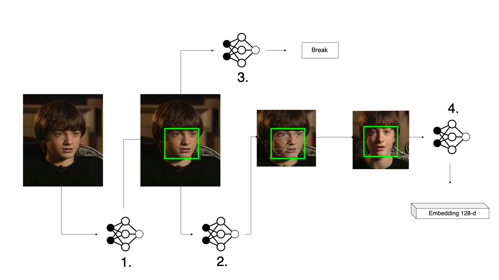

<h1 align="center"> ~ Virtual Security Assistant ~ </h1>

Have you ever desired a personal tireless [keeper](https://media.urbanpost.it/wp-content/uploads/2019/03/ScreenShot2016-01-19at4.18.36PM.jpg) able to recognize people passing through your gate and inform you whenever you want? Do you want to remove badges from your office and automatically and precise take note of all people coming in and out? Or, do you want to create your personal "[big brother](https://qph.fs.quoracdn.net/main-qimg-d30d05225145292c4e9186a4c8fac778)" world in your neighborhood?
If so, this repository is right for you. Powered by a cascade of four state of the art very stupid and completely unaware neural networks, this repository is giving you the possibility to recognize with a cheap and low range camera all persons transit in its field of view. Moreover, all data is saved and stored in a practical ".json" file that can be used for whatever you want. For example, we created a very simple server able to parse this file and interact with Google Assistant. So, when everything is set, you will be able to wake up your google assistant from whatever device you like and ask who have been spotted by your Virtual Security Assistant. 

All code have been tested on a NVDIA 2080 that can easilly give you more than 40 fps. Moreover, it perfectly works also on a [Jetson Xavier](https://www.nvidia.com/it-it/autonomous-machines/embedded-systems/jetson-agx-xavier/) that can be easily installed on the site where you want to deploy your sistem (let's move this AI on the edge).

**Side Notes**:
This repository is a stupid demo made in a hurry for our robotic center by me and ?. It has been a distraction from our research, but with the community help can really become an interesting and helpful project. It is based on [dbib](http://dlib.net/) and heavily inspired by [face_recognition](https://github.com/ageitgey/face_recognition) repository. Whover has worked with the "face_recognition" repository knows that it doesn't work very well and is far from been reliable and accurate. We improved the general framework and put everything together in sweet and compact ready to work system. We intentionally left a easy customizable framework in order to let the community work and improve this Virtual Security Assistant.

## How it works

Let's see very briefly how the general framework works. There are four networks running behind the curtains. They all worked in a cascade manner. So, the output of the first network is the starting point of the second one and so on. 

- **1. Faces detection:** the first one is a convolutional neural network (CNN) trained to search in an image the presence of faces. Its outputs are all possible bounding boxes related with detected faces. 
- **2. Facial landmarks detection:** for all detected faces (locations given by the bounding boxes detected by the previous network) we crop the portion of the face and we feed a second network to get [facial landmarks](https://miro.medium.com/max/828/1*AbEg31EgkbXSQehuNJBlWg.png). These are a bunch of points of detected faces that highlight certain specific locations like eye, nose, etc. We use these points to pose and project all faces more parallel as possible to the camera. Doing so, it increases the accuracy and the precision of the overall pipeline. The framework, also, gives you the possibility to draw on all detected faces these points creating a cool 007 like [effect](https://article.images.consumerreports.org/f_auto/prod/content/dam/CRO%20Images%202019/Electronics/05May/CR-Electronics-InlineHero-Facebook-Clarifies-Facial-Recognition-05-19-v2).
- **3. Face side detection:** before feeding the last network (4), with all detected faces (locations given by the bounding boxes detected by the first network), we feed a third CNN model. This network is responsible to detect if the face is in "side" position. This is a really important passage, because the rest of the pipeline doesn't work well with faces in side position. Indeed, in case of a side face, the projecting algorithm distorts so much the resulting face that the last network produces pretty random results. So, if a certain face is in side position we don't further process that particular face, but we only show a red bounding box around it (the framework gives you the possibility to blur this unrecognized face).
- **4. Embeddings generation:** this is the part I like most. Practically, for all detected not side projected face we use a final network to generate a vector (simply a list of numbers) of 128 elements. These are not random numbers, but are "attributes" that the network has learnt to give at every face is feeded with. As if we are ask to describe a face we start to say the color of the eyes, hair, etc...the same does the network, but with numbers. This is soo cool and it encapsulates most of the philosophy of Deep Learning. So, at the end of this long neural pipeline we have for each face, for example present in a video frame, a nice and clean vector that gives a very accurate representation of the corresponding face.

Let's see all together with a graphical representation:

First we use the first network to detect possible faces in the given image. Then, we find the facial landmarks of our detected favorite wizard. At the same time, the third network says us that we are good to go and so, we can safely feed the last one producing the so wanted embedded representation.

But, wait! Where is the recognition part? Hey, clever question!

After getting our embedded representations, we compare it with a database with known faces. Faces that we want to recognize with our Virtual Security Assistant. About this, the framework let you easily capture a video where then automatically extracts some frames that are processed by the already explained pipeline. At the end of this "video capturing" procedure we have for each person inserted in the system a list of N embedded vectors. So, simply at run time we compare our extracted new embeddings with our database list.

We can do that in three different ways: 

- with simply [Euclidean distance](https://en.wikipedia.org/wiki/Euclidean_distance) meause between our new ebedded and the database. This is simple and has pretty good results, but scales bad with many knwown persons inside the database. That because I have to perform a mesure for all persons and all their embeddings inside the database.
- a solution is using k-neearest neighboorhood. The framework let you easily train a k-nn model with the acquired dataset and then perform inference with the trained model. This is faster and in most of the cases mantains a similar accuracy.
- finally, we can train a simple multi-layer perceptron trained to classify new embeddings. We didn't include this multi-layer perceptron feature in this repository for a series of unfortunate events.

Now, you should have all information to undestarstand what is going on in this repository. So, let's get started!

# 1.0 Getting Started

Coming soon...
